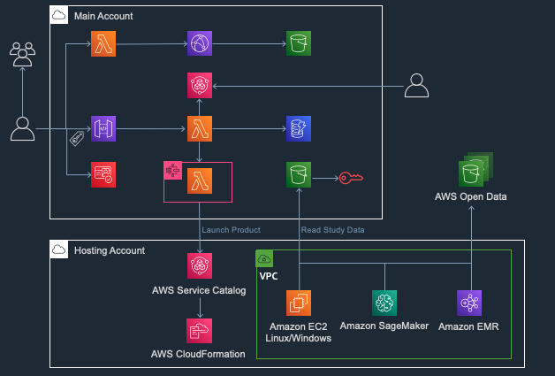

# Service Workbench on AWS

## Overview

Service Workbench on AWS is a cloud solution that enables IT teams to provide secure, repeatable, and federated control of access to data, tooling, and compute power that researchers need. With Service Workbench, researchers no longer have to worry about navigating cloud infrastructure. They can focus on
achieving research missions and completing essential work in minutes, not months, in configured research environments.

With Service Workbench on AWS, researchers can quickly and securely stand up research environments and conduct experiments with peers from other institutions. By automating the creation of baseline research setups, simplifying data access, and providing price transparency, researchers and IT departments save time, which they can reinvest in following cloud best practices and achieving research
reproducibility.

## Service Workbench architecture

Service Workbench integrates existing AWS services, such as Amazon CloudFront, AWS Lambda, and AWS Step Functions. Service Workbench enables you to create your own custom templates and share those templates with other organizations. To provide cost transparency, Service Workbench has been integrated with AWS Cost Explorer, AWS Budgets and AWS Organizations.

There are three types of Studies available in Service Workbench: My Studies, Organizational Studies and Open Data. Once you have created a Study you can upload files to it. Organizational Studies can be shared with other members in the organization. Owners of a study can amend the permissions of the study to grant access to other users. Once you have found the study or studies in which you are interested to perform research, you can deploy a workspace to attach the data to and conduct your research. 

### Main account

This is the account where Service Workbench infrastructure is deployed.


### Hosting account

This is the account where compute resources are deployed.



## Service Workbench components

Service Workbench contains the following components.You can find these components under the <service_workbench>/main/solution folder.

**Infrastructure**: The following AWS resources are created as part of this component deployment:
+ S3 bucket is used for logging the following actions:
     + Study data uploads
     + Accessing CloudFormation templates bucket
     + Accessing Cloudfront distribution service
     + To host the static Service Workbench website.
+ Cloudfront distribution service to accelerate Service Workbench website access based on user location.
**Backend**: Once the environment has been deployed, the backend component creates and configures the following AWS resources:
 + S3 bucket: 
     + To store uploaded study data. This bucket also receives an encryption key from AWS Key Management Service for encrypting this data and making it available to the Service Workbench website.
     + To store bootstrap scripts. These scripts will be used to launch the workspace instances like SageMaker, EC2, EMR.
     + This component also sets up some IAM roles and policies for accessing lambda functions and invoking step functions.
     + DynamoDB: This database will be used to store information concerning user authentication, AWS accounts, workflows, access tokens, study data etc. 
 This component is also responsible for deploying the following lambda functions/services:
     + Authentication layer handler - Handles the authentication layer for API handlers.
	+ Open data scrape handler - Handles scraping the metadata from the AWS open data registry.
     + API handler - Provides a path for public and protected APIs.
     + Workflow loop runner - Invoked by AWS step functions.
**Edge Lambda**: An inline Javascript interceptor function that adds security headers to the Cloudfront output response. This function is declared inline because the code requires API Gateway URL for the backend APIs.
**Machine images**: Deploys spot instances using machine images for EC2 and EMR templates.
**Prepare master accounts**: Creates a master IAM role for organization access.
**Post Deployment**: Creates an IAM role for the post deployment function with policies granting permission to S3 buckets, DynamoDB tables, KMS encryption key, Cloudfront and lambda functions.
**User Interface**: Contains code used to create and support the UI functionality of the application.

The solution also includes a Continuous Integration/Continuous Delivery feature:
+ main/cicd/cicd-pipeline
+ main/cicd/cicd-source

# Installing Service Workbench

## Accessing Service Workbench Documentation

Service Workbench documentation can be accessed in the PDF format or by using the Docusaurus website. 

### Documentation PDFs

You can download the PDF versions if you do not have Service Workbench locally installed on your machine. Click the following links to download:

+ [Service Workbench Installation Guide](/docs/Service_Workbench_Installation_Guide.pdf)
+ [Service Workbench Configuration Guide](/docs/Service_Workbench_Configuration_Guide.pdf)
+ [Service Workbench Post Deployment Guide](/docs/Service_Workbench_Post_Deployment_Guide.pdf)
+ [Service Workbench User's Guide](/docs/Service_Workbench_User_Guide.pdf)

### Accessing Documentation using Docusaurus

You first need to download the Service Workbench [source code](https://github.com/awslabs/service-workbench-on-aws/tags) on your local machine before accessing the documentation using Docusaurus. After downloading the source, you need to install Docusaurus so that you can launch the help site. For steps on how to install Docusaurus locally, read the [Documentation Readme](/docs/README.md).

## Software requirements

- **Node.Js:** [Node.js v14.x](https://nodejs.org/en/) is required.
- **PNPM:** Install [pnpm](https://pnpm.js.org/en/) as follows

```bash
npm install -g pnpm
```

- **Go:** You also need to install [Go 1.13.7](https://golang.org/doc/install) or later. `Go` is used for creating a multipart S3 downloader tool that is used in AWS Service Catalog EC2 Windows based research environments.

For more information, refer to the **Prerequisites** section of the Service Workbench Deployment Guide.

## Creating a configuration file

To create the initial settings files, take a look at the example.yml settings file in main/config/settings/example.yml and create your own copy.
The stage is either 'example' or your username. This method should be used only for the very first time you install this solution.
In the rest of this README, \$STAGE is used to designate the stage.

For more information, refer to the **Prepare Main Configuration File** section of the Service Workbench Deployment Guide.

## Deploying Service Workbench

You can run the Service Workbench installation from your local machine or an Amazon Elastic Compute Cloud (Amazon EC2) instance. The installation involves the following:
+ Download and unpack the Service Workbench code.
+ Choose a stage name.
+ Optionally, edit the configuration file.
+ Run the main deployment script: environment-deploy.sh.
+ Run the post-deployment script: master-account-deploy.sh.
+ Log in and add an AWS account to your Service Workbench deployment.
+ Create local user accounts.

Now, let's perform an initial deployment. Note that when invoked without parameters, this will assume a deployment stage of \$USER, which is the logged-in user name on Mac and Linux systems.

```bash
scripts/environment-deploy.sh
```

You can override the default stage name of \$USER if you prefer. For example, if you want your stage name to be `qa`, then:

1. create main/config/settings/qa.yml
2. run `scripts/environment-deploy.sh qa`

## Deploying Service Workbench components individually

In case you have made some changes to the Service Workbench components after the initial deployment, use these commands to re-deploy these components individually. There won't be any change to your installation if you have not changed any of the components.

Following an initial successful deployment, you can subsequently deploy updates to the infrastructure, backend, and post-deployment components as follows:

```bash
cd main/solution/<component>
pnpx sls deploy -s $STAGE
cd -
```

To run (rerun) the post-deployment steps:

```bash
cd main/solution/post-deployment
pnpx sls invoke -f postDeployment -s $STAGE
cd -
```

To re-deploy the UI

```bash
cd main/solution/ui
pnpx sls package-ui --stage $STAGE --local=true
pnpx sls package-ui --stage $STAGE
pnpx sls deploy-ui --stage $STAGE --invalidate-cache=true
cd -
```
**Note**: These are optional steps.

## Viewing deployment information

To view information about the deployed components (e.g. CloudFront URL, root password), run the
following, where `[stage]` is the name of the environment (defaults to `$STAGE` if not provided):

```bash
scripts/get-info.sh [stage]
```
## Running Service Workbench on a local server

Once you have deployed the app and the UI, you can start developing locally on your computer.
You will be running a local server that uses the same lambda functions code. To start local development, run the following commands to run a local server:

```bash
cd main/solution/backend
pnpx sls offline -s $STAGE
cd -
```

Then, in a separate terminal, run the following commands to start the ui server and open up a browser:

```bash
cd main/solution/ui
pnpx sls start-ui -s $STAGE
cd -
```

---
For more information, refer to *Service Workbench Installation Guide*.

## Using Service Workbench

## Creating a new user in Service Workbench

Once Service Workbench is fully deployed, the console will output the Website URL and Root Password for Service Workbench. You can log in by navigating to the Website URL in any browser, and then using the username 'root' and the Root Password given by the console. Please note that logging as the root user is highly discouraged, and should only be used for initial setup. You can create a new user by clicking the "Users" tab on the left, then "Add Local User". Follow the instructions given to create the user (you can leave the 'Project' field blank for now), then log out of the root account and into your new user account.

Adding a local user should only be done in test environments. We highly recommend using an IDP for prod environments. For more details on how to set up an IDP, click [here](/docs/docs/user_guide/sidebar/admin/auth/introduction.md)
## Linking an existing AWS account

Once in your user account, you'll need to link your AWS account. Navigate to "AWS Accounts" in the left bar, then click the "AWS Accounts" tab. From here, you can create an AWS account, or link an existing one.

To create a new AWS account, you'll need the "Master Role ARN" value, which you can get by contacting the owner of your Organization's master account. If you are the owner, you can find it in the Roles section of [AWS IAM](https://aws.amazon.com/iam/) from the [AWS management console](https://aws.amazon.com/console/).

To link an existing account, follow the instructions listed. You'll need the following credentials:

- **AWS Account ID** ([Where can I find my AWS Account ID?](https://www.apn-portal.com/knowledgebase/articles/FAQ/Where-Can-I-Find-My-AWS-Account-ID))
- **Role ARN**: An ARN to an IAM Role to use when launching resources using Service Workbench. You can find or create an IAM Role in the IAM service from the [AWS management console](https://aws.amazon.com/console/).
- **AWS Service Catalog Role ARN**: Another ARN to an IAM Role, which will be used for launching resources using Service Workbench's Service Catalog. This entry can be the same as the above if you choose.
- **VPC ID**: The ID of the VPC your AWS account uses. You can find this in the [VPC Service](https://aws.amazon.com/vpc/) of the [AWS management console](https://aws.amazon.com/console/).
- **Subnet ID**: The ID for the subnet of the VPC to use. This can also be found in the [VPC Service](https://aws.amazon.com/vpc/) of the [AWS management console](https://aws.amazon.com/console/).
- **KMS Encryption Key ARN**: The ARN of the KMS Encryption Key to use for the AWS Account. You can find or create a KMS Encryption Key in the [KMS service](https://aws.amazon.com/kms/) of the [AWS management console](https://aws.amazon.com/console/).

## Creating a Workspace

### Overview
Now that you have a user and have a working AWS account, we can start generating workspaces. Workspaces allow you to use AWS resources without having to manually set up and configure them. In order to create a workspace, your account has to be associated with a project, which has to be created under an index.

### Creating a project

1. Navigate to the **Accounts page** and choose the **Indexes** tab.
2. Choose **Add Index**. Each project you create is associated with an index, allowing you to group multiple projects together under a single index linked to your AWS account.
3. Create a project by choosing the **Projects** tab.
4. Choose **Add Project**.
5. Associate it with the index you just created, and assign yourself as the project administrator.
6. Navigate to the **Users** page to see that the project has been successfully associated with your account.

### Creating a workspace
Pre-requisites: Before creating a workspace, you must setup Service Catalog. Refer to the “Import a Product” section of the Service Workbench Deployment Guide for information on installing Service Catalog.

1.	In the Workspaces tab, choose **Create Research Workspace**. A menu with options is displayed. 
     **Note**: Service Workbench automatically provisions AWS resources according to your selection, so you can run your projects on AWS without having to worry about the setup.
2. Choose the desired platform and then choose Next.
3. Enter appropriate values for the field names (leave 'Restricted CIDR' as-is if you don't know what it is) and select a configuration.
     **Note**: Each configuration lists the details for its instance--On Demand instances are more expensive than Spot instances, but they're available whenever you need them. For more details on pricing and configurations, refer to the [Instance Purchasing Options](https://docs.aws.amazon.com/AWSEC2/latest/UserGuide/instance-purchasing-options.html) and the [AWS Pricing](https://aws.amazon.com/pricing/) pages.
4.	Your workspace may take some time to launch. Once it is up and running, you can connect to it by choosing Connect. For more details, see the following documentation pages:
     + AWS SageMaker: Service Workbench takes care of provisioning the workspace for you, so you can jump straight to working with SageMaker Notebooks. For more information, see the [SageMaker Getting Started Guide](https://docs.aws.amazon.com/sagemaker/latest/dg/gs-console.html) (you can jump straight to Step 4).
     + AWS ElasticMapReduce (EMR): Service Workbench takes care of setting up the EMR instance for you, so you can jump straight to working with EMR Notebooks. For more information on using EMR Notebooks, see [Using EMR Notebooks](https://docs.aws.amazon.com/emr/latest/ManagementGuide/emr-managed-notebooks.html). **Note:** A password may be required to access the EMR Notebooks. By default, this password is 'go-research-on-aws' (without the quotes).
     + RStudio: You can connect to RStudio workspace type by using the template and AMI provided in AWS partner's [repository](https://github.com/RLOpenCatalyst/Service_Workbench_Templates). For more information, refer to the [Create RStudio ALB workspace](/deployment/post_deployment/aws_accounts#creating-rstudio-alb-workspace) section of *Service Workbench Post Deployment Guide*.
     + AWS Elastic Compute Cloud (EC2): EC2 instances are essentially Virtual Machines in the cloud. For more information, see the [EC2 Documentation](https://aws.amazon.com/ec2/).

## Create a Study

### Overview

Studies are datasets that you can tell Service Workbench to preload onto your workspaces. When your workspace has finished provisioning, you will immediately have access to any datasets within Studies associated with that workspace.

### Creating a Study

In the navigation pane, under the Studies tab, choose Create Study. The ID field represents the ID for that particular dataset. Studies can also be associated to projects using the Project ID field. Once the study has been created, you can upload data files with the Upload Files button.

### Setting workspace properties

Once you have a study with datafiles loaded, you can start provisioning workspaces with your study data. In the Studies tab, select one or more studies. The data in these studies is preloaded onto the AWS compute platform. In addition to your own studies, you can also choose from your organization's studies and/or open data studies (publicly available datasets).
After choosing your desired studies, click Next to create a workspace. Refer to the Workspaces section for documentation on the compute platforms.

### Creating a workspace using study data

Once you have finished determining the properties of your workspace, Service Workbench generates your workspace and preloads it with your study data. You can access it from the Workspaces page by choosing the Connect button on your workspace.


## Code Customization

Start by looking at these files:

- main/packages/services/lib/hello/hello-service.js
- main/packages/controllers/lib/hello-controller.js
- main/solution/ui/src/parts/hello/HelloPage.js

They are meant to provide a sample service, a sample controller and a sample UI page.

### Adding a custom Service Catalog product

Follow these steps to add a custom Service Catalog product:

1. Add your custom CloudFormation template in the `addons/addon-base-raas/packages/base-raas-cfn-templates/src/templates/service-catalog` folder.
2. Add your new product's details in the format specified in the file `addons/addon-base-raas/packages/base-raas-post-deployment/lib/steps/create-service-catalog-portfolio.js` (lines 23-35).
      
     **Note**: Line numbers might change in a future release.
3. Run the `environment-deploy.sh` script.

## Audits

To audit the installed NPM packages, run the following commands:

```bash
cd <root of git repo>
pnpm audit
```

Please follow prevailing best practices for auditing your NPM dependencies and fixing them as needed.

---

## Recommended Reading

- [Serverless Framework for AWS](https://serverless.com/framework/docs/providers/aws/)
- [Serverless Stack](https://serverless-stack.com/)
- [Configure Multiple AWS Profiles](https://serverless-stack.com/chapters/configure-multiple-aws-profiles.html)
- [Serverless Offline](https://github.com/dherault/serverless-offline)
- [Github documentation](https://git-scm.com/docs)

## License

This project is licensed under the terms of the Apache 2.0 license. See [LICENSE](LICENSE).
Included AWS Lambda functions are licensed under the MIT-0 license. See [LICENSE-LAMBDA](LICENSE-LAMBDA).


