import useBaseUrl from '@docusaurus/useBaseUrl';

### Updating accounts

You can use Azure AD to create and manage domains, users, and objects within a network. It provides a way to organize a large number of users into logical groups and subgroups. It also provides access control at each level. For more information about IdPs, see [Identity Providers](https://docs.microsoft.com/en-us/azure/active-directory/external-identities/identity-providers).

Azure AD (or any IdP) is a source of authentication. It authenticates users for Service Workbench login. After successful Azure AD login, it sends user information to an Amazon Cognito user pool created by Service Workbench. Service Workbench then uses the Amazon Cognito user pool for its internal use as described in [Service Workbench and IdP workflow](/configuration_guide/workflow).

## To configure Azure AD authentication:

### Create an Azure AD directory
* Log in to [Azure Portal](https://portal.azure.com) using a new or existing Microsoft account
* Under **Azure Services**, select **Azure Active Directory** (you may have to click on **more services** to scroll Active Directory into view)
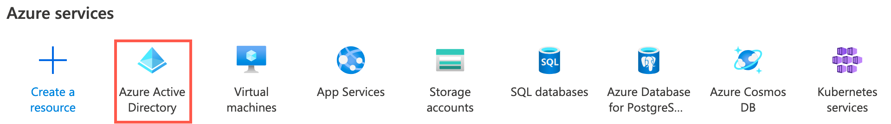

#### Create a Tenant and Primary Domain
* In Azure Active Directory, **Default Directory**, click ‘Create a tenant’.  You may first need to select ‘Manage tenants’.
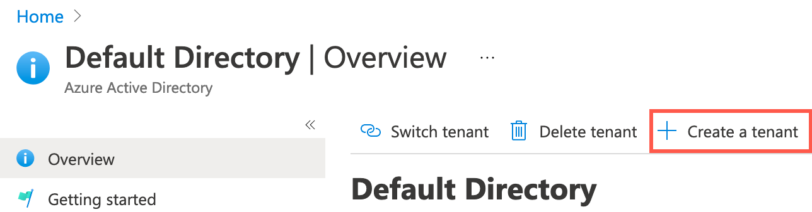
* In **Create a tenant**, **Basics** tab, select **Azure Active Directory** and proceed to Configuration.
* In **Create a tenant**, **Configuration** tab, enter the name and domain name of your organization.  The domain name must be globally unique in the `.onmicrosoft.com`  URL space.
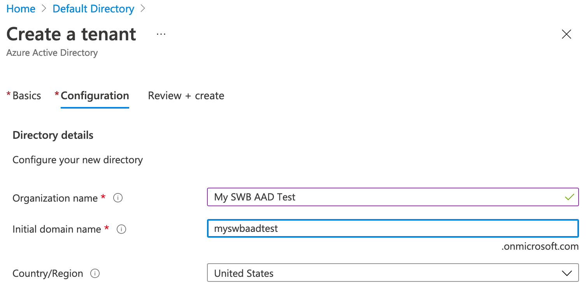
* Proceed to the **Review + create** tab and click **Create**

#### Create Users
* In your tenant, select **Users** from the left-hand menu bar. Also note your primary domain name.
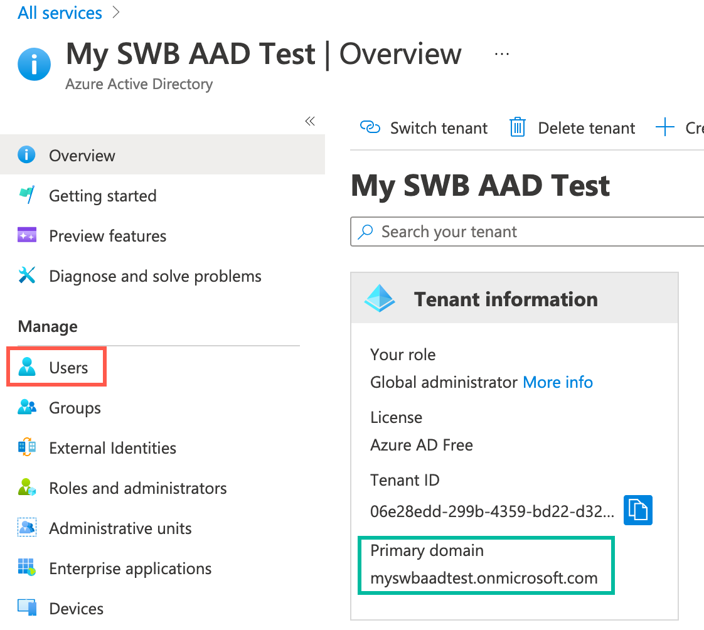
* Create one or more users by clicking **Create new user**.  While only the **Name** (full name) field is required, it is helpful to also fill in the **First Name** and **Last Name** fields, as these may be required by your application.
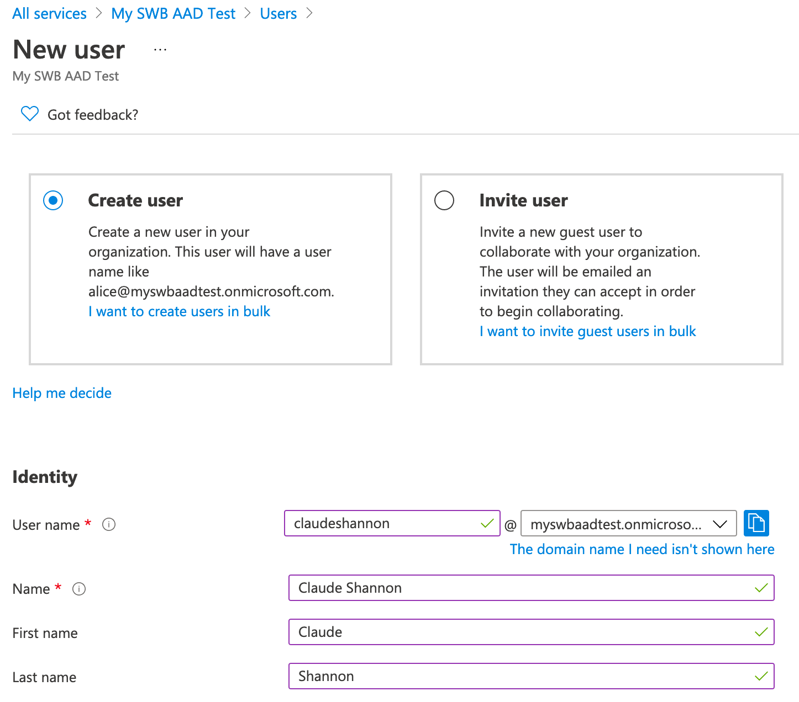

#### Create an Azure AD Application
* From your tenant (top level) page, select **Enterprise Applications** from the left menu bar, and select **New application**
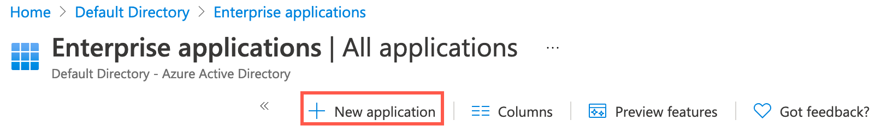
* In **Browse Azure AD Gallery**, select **Create your own application**
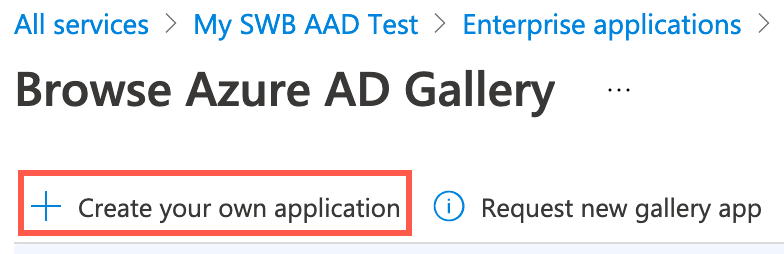
* Retain the **Non-gallery** setting and give your application a name.  Click **Create**.
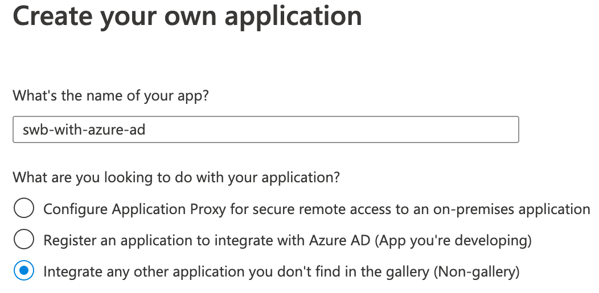

#### Add Users to your Application
* From within your application, select **Assign users and groups**.
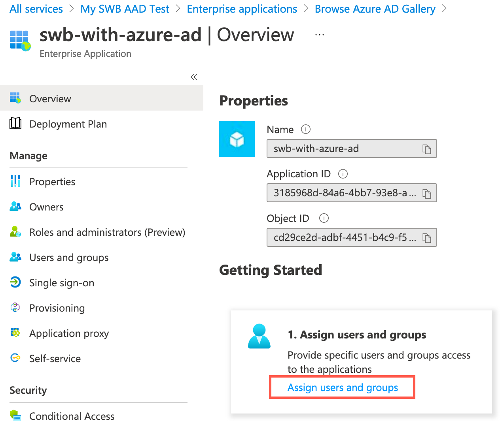
* Click **Add user/group**
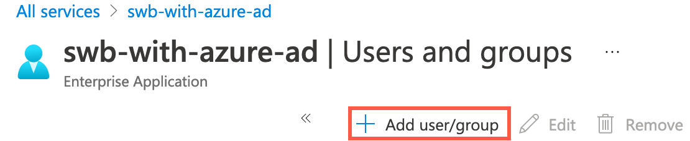
* Select the users to add, and click **Select**, then **Assign**
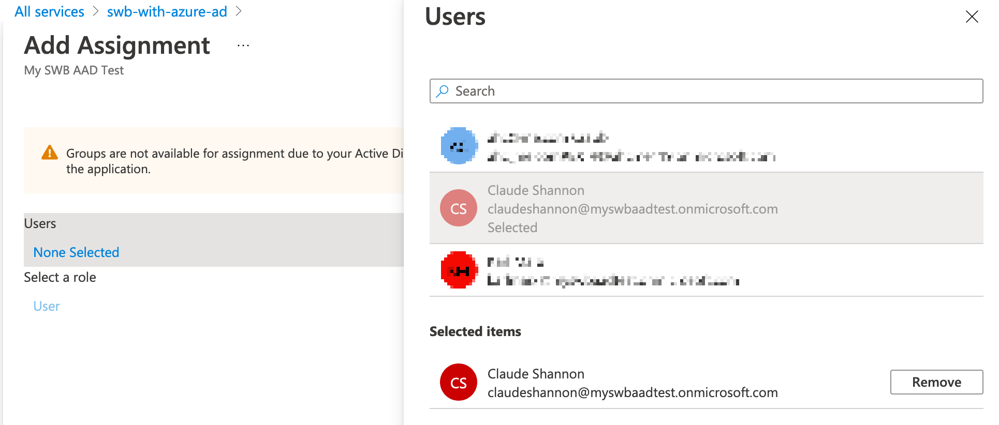

#### Enable Single Sign-On
* In your application, select **Single sign-on** from the left menu bar, and **SAML**
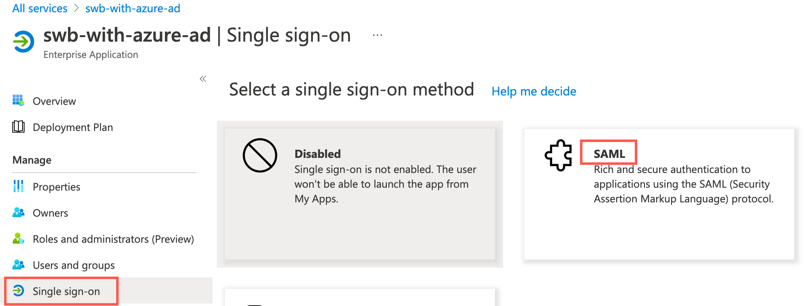
* From **SAML-based Sign-on**, box 3, copy **App Federation Metadata Url**, which will be needed in the Service Workbench configuration.
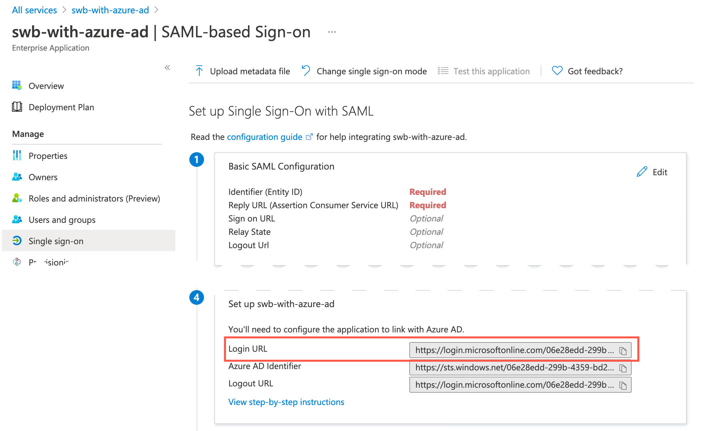

#### Configure Azure AD in Service Workbench
* In the Service Workbench installation terminal, edit the main configuration file `main/config/settings/<stage>.yml`:
	* `fedIdpIds` - The **Primary Domain** of your Active Directory.  E.g.: `yourdirectory.onmicrosoft.com`
	* `fedIdpNames` - Short name for the login, such as `AzureAD`
	* `fedIdpDisplayNames` - Long name for the login, such as `Log in using Azure AD`
	* `fedIdpMetadatas` - **App Federation Metadata Url** from above
		* `https://login.microsoftonline.com/000/federationmetadata/2007-06/federationmetadata.xml?appid=000`
* Run `environment-deploy.sh ${STAGE}`
* Run `get-relying-party-info.sh ${STAGE}` and take note of the following values:
	* **Relying Party Id (Cognito User Pool URN)**
	* **(Login) SAML Assersion Consumer Endpoint**
	* **(Logout) SAML Logout Endpoint**
    
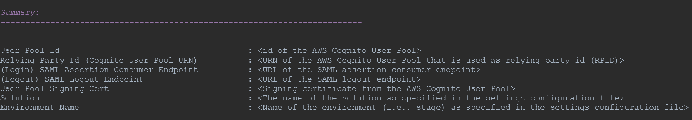

#### Configure SAML Configuration in Azure Active Directory
* In Active Directory, open the **Single sign-on** tab of your application and edit box 1, **Basic SAML Configuration** with the values just noted:
	* **Identifier (Entity ID)** - use **Relying Party Id** above, e.g.: `urn:amazon:cognito:sp:us-east-1_xxx`
	* **Reply URL (Assertion Consumer Service URL)** - use **SAML Assertion Consumer Endpoint**, e.g.: `https://STAGE-prod-sw.auth.us-east-1.amazoncognito.com/saml2/idpresponse`
	* **Logout Url** - use **SAML Logout Endpoint**, e.g.: `https://STAGE-prod-sw.auth.us-east-1.amazoncognito.com/saml2/logout`
