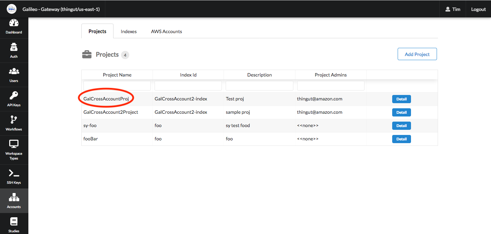
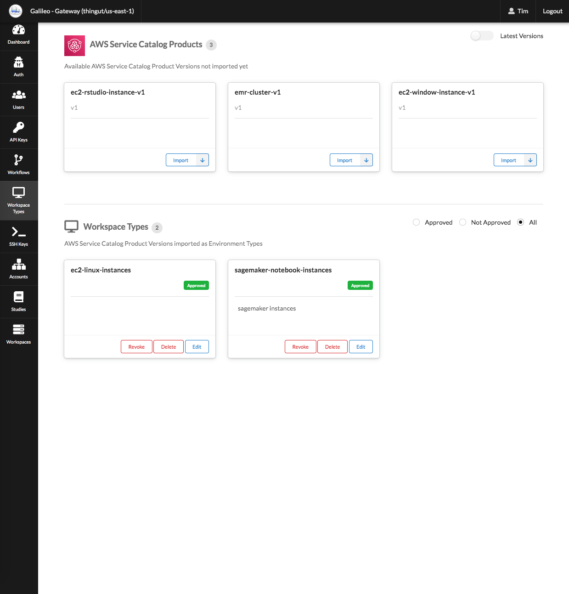
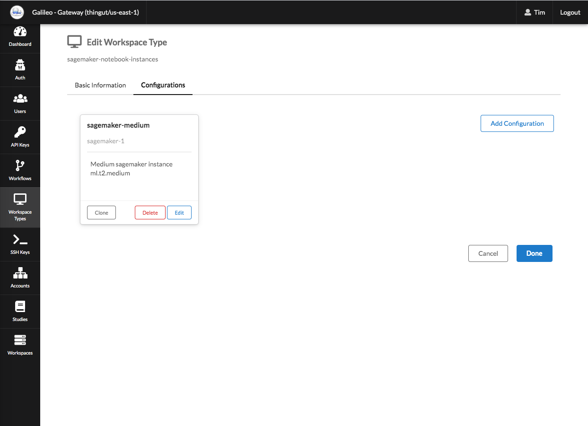

# Cypress End to End Testing

This package runs End to End tests on Galileo from the perspective of a customer. While unit tests helps ensure that each component works as designed, E2E tests will helps us that the components still fit together as a whole. 

To see videos of the test cases that are covered, please check out the videos in `test-case-videos`. Each test case in `cypress/integration` will have a corresponding video saved in `test-case-videos`. The video shows what the test looks like when it passes.

## Setup
In this section we will discuss how you can run these tests from your desktop.

To run the E2E tests, you will need the following items:
* A Galileo environment setup with Service Catalog
* Username and password of a researcher for the Galileo environment
* A project set up for that researcher that can launch EC2 workspaces and Sagemaker workspaces
* A configured EC2 workspace
* A configured Sagemaker workspace

Once you've confirmed that you have the items above setup, you can create a `cypress.dev.json` and a `cypress.local.json` file with the configurations needed for your tests. You can use `cypress.json` as a template for your new configuration files.

The **baseUrl** for `cypress.local.json` should be `http://localhost:3000` while the **baseUrl** for `cypress.dev.json` should be the cloudfront url for your Galileo instance. Something like `https://abcd1234.cloudfront.net`

Example of what the other variable values could be is shown below.

**projectId**

**sagemaker-workspaceTypeName:** sagemaker-notebook-instances
**ec2-workspaceTypeName:** ec2-linux-instance

 
**sagemaker-configuration:** sagemaker-medium

### Running tests
**Locally**

To run the E2E tests against your local Galileo environment, make sure that you have a `cypress.local.json` config file. Also make sure that your environment is currently accessible at `http://localhost:3000`. 

Run this command: `pnpm run cypress:run-tests:local`

You can also see the tests live by running: `pnpm run cypress:open:local`

**Hosted Dev Environment**

To run the E2E tests against your hosted dev environment, make sure that you have a `cypress.dev.json` config file. Also make sure that your environment is currently accessible at the **baseUrl** specified in `cypress.dev.json`. 

Run this command: `pnpm run cypress:run-tests:dev`

You can also see the tests live by running: `pnpm run cypress:open:dev`