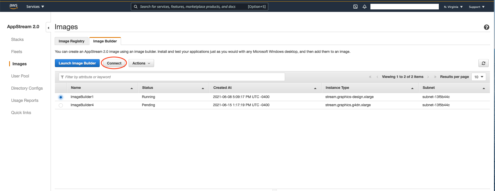

# Overview

This following guide will show you how to set up an AppStream image with the following applications installed: Firefox, Notepad, PuttyGen, and Putty. AppStream should be built in the **member account**. 

### High Level Overview
1. We launch an AppStream Image Builder instance.
2. We log into the AppStream Image builder instance and run a script to build an image with Firefox, PuttyGen, Putty, and Notepad.

### Pre-requisite

If you haven't navigated to AWS AppStream in your main account via the AWS Management Console, please do so first. Click "Get Started" on the screen and then click "Next". This activates AppStream in your main account, following which you could proceed with the commands in `SETUP.md` file.

### Launching an AppStream Image Builder instance
1. Navigate to `scripts/app-stream` directory
2. Run the following commands
```
npm install
npm run start-image-builder -- <AWS Profile> <region> <Base image name> <instance size>
# Example: npm run start-image-builder -- default us-east-1 AppStream-WinServer2019-06-01-2021 stream.standard.medium
# If preferred you can choose the default base image name and instance size by running this command: npm run start-image-builder -- default us-east-1 default default 
```
Note: Please set up your [AWS Profile](https://docs.aws.amazon.com/cli/latest/userguide/cli-configure-profiles.html) beforehand so that you have permission to launch an AppStream image builder instance in your AWS Account.
3. Once the Image Builder is launched and ready, click on the URL provided in the terminal console. This will take you to the AppStream page on the AWS Console.

### Building AppStream Image

1. On the AppStream page in AWS console, select the AppStream image that was built in the previous step and click Connect. 
2. This will open a new tab in your browser. When the prompt ask for which user you would like to log in as, choose Administrator. This will take you to a Windows Desktop that you can interact with to create your AppStream image. 
3. On the Windows desktop, click the `Start` button and type in `Windows Powershell`. Right click the application in the search result, and choose `Run as administrator`
4. Run the following commands

```
cd ~\Documents

# Pull the Image Builder script from Github
Invoke-WebRequest -Uri https://raw.githubusercontent.com/awslabs/service-workbench-on-aws/mainline/scripts/app-stream/buildImage.ps1 -OutFile buildImage.ps1

# Execute Image builder script
.\buildImage.ps1
```

5. At this point the Image builder will build your image and you'll see a "Failed to reserve a session" modal. This is expected. Log back into AppStream on the AWS Console and wait till the AppStream image is built.